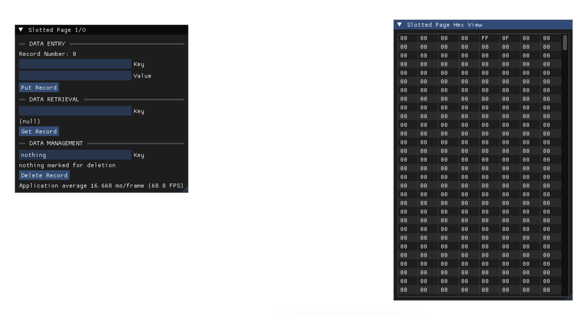

# emsc-slotted-page

Interactive slotted page data structure on a webpage using SDL and ImGui.

## Info
- Refer to [design doc](docs/design.md) for more information on implementation
- Used "Database Internals" by Alex Petrov for reference
